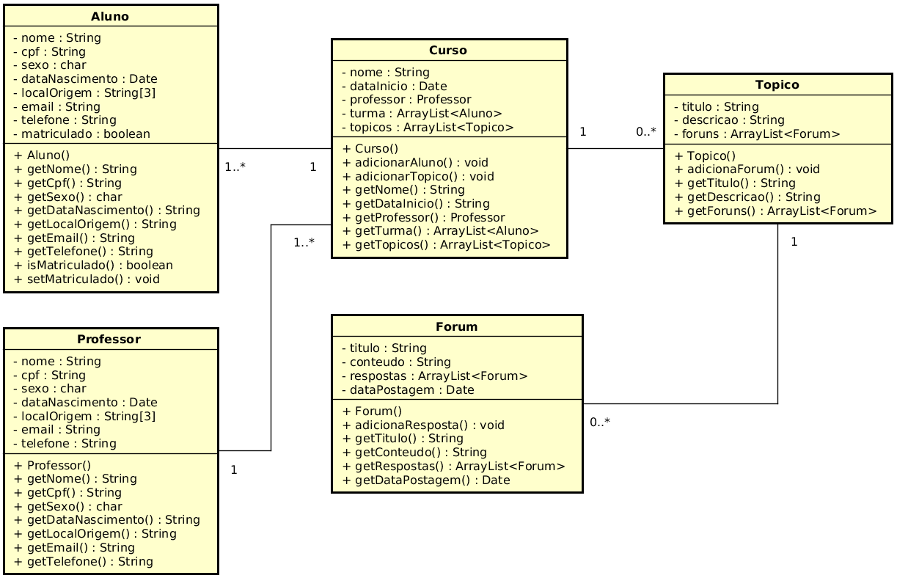
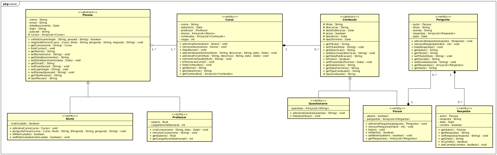

# Projeto da Disciplina de Programação Orientada a Objetos

**Tema do projeto:** Sistema de Ensino a Distância (estilo Moodle).

**Nome do Projeto:** Doodle

| Baixar código fonte apartir de etapa específica do projeto   |
| :----------------------------------------------------------- |
| [Primeira Etapa](https://github.com/wzoreck/Doodle/releases/tag/V1.0_Primeira_Etapa) - Abstração e Encapsulamento |
| [Segunda Etapa](https://github.com/wzoreck/Doodle/releases/tag/V2.0_Segunda_Etapa) - Herança e Polimorfismo |                            


------

### 1ª Etapa

**Objetivo:** Elaborar um projeto no Eclipse com no mínimo 5 classes que estão  associadas entre si. Faça uso do encapsulamento e de métodos  construtores em todas as classes. O projeto deverá ser executado pela  linha de comando e deve ser possível **criar e listar**, em tempo de execução e através de um menu, objetos de cada uma das 5 classes


**Diagrama de Classes (UML)**





**Estrutura de diretórios do projeto**

```shell
.
├── bin
├── documentacao
│   ├── diagramas.asta
│   └── primeira_etapa_diagrama_de_classes.png
├── README.md
└── src
    └── doodle
        ├── Aluno.java
        ├── Curso.java
        ├── Forum.java
        ├── Main.java
        ├── Professor.java
        └── Topico.java
```

------

### 2ª Etapa

**Objetivo:** 

1. Organize o projeto de tal forma que ele contenha no mínimo 2 pacotes;
2. Todas as classes devem possuir pelo menos uma sobrecarga do método construtor, **que faça sentido**;
3. Substitua todos os usos de vetores por listas;
   - Na Main, deve ser possível **adicionar, listar, atualizar e remover** objetos de **cada uma das entidades**.
4. Crie uma hierarquia com herança, que faça sentido, onde exista pelo menos uma classe mãe e duas classes filhas;
   - A hierarquia na qual a mãe é a classe Pessoa (ou similar) não conta;
5. Na Main, trabalhe com polimorfismo, isto é, com referências para as classe mães, quando existirem;
6. Toda classe mãe deverá ser abstrata e possuir pelo menos um método abstrato.


**Diagrama de Classes (UML)**




**Estrutura de diretórios do projeto**

```shell
.
├── bin
├── _documentacao_
│   ├── diagramas.asta
│   ├── primeira_etapa_diagrama_de_classes.png
│   └── segunda_etapa_diagrama_de_classes.png
├── README.md
└── src
    └── doodle
        ├── entidades
        │   ├── Aluno.java
        │   ├── Conteudo.java
        │   ├── Curso.java
        │   ├── Pessoa.java
        │   └── Professor.java
        ├── forum
        │   ├── Forum.java
        │   ├── Pergunta.java
        │   └── Resposta.java
        ├── Main.java
        └── questionario
            └── Questionario.java
```

------

