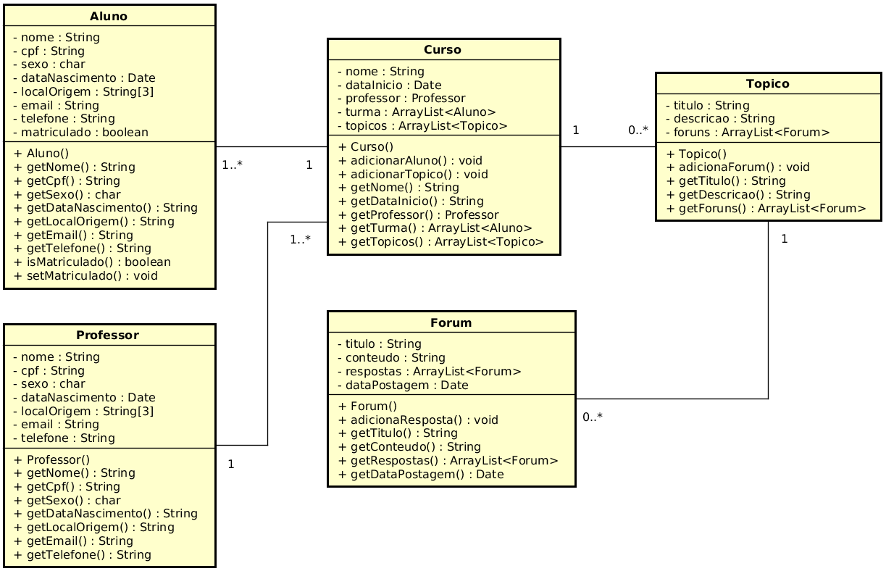

# Projeto da Disciplina de Programação Orientada a Objetos

**Tema do projeto:** Sistema de Ensino a Distância (estilo Moodle).

**Nome do Projeto:** Doodle

| Baixar código fonte apartir de etapa específica do projeto   |
| :----------------------------------------------------------- |
| [Primeira Etapa](https://github.com/wzoreck/Doodle/releases/tag/V1.0_Primeira_Etapa) - Abstração e Encapsulamento |


------

### 1ª Etapa

**Objetivo:** Elaborar um projeto no Eclipse com no mínimo 5 classes que estão  associadas entre si. Faça uso do encapsulamento e de métodos  construtores em todas as classes. O projeto deverá ser executado pela  linha de comando e deve ser possível **criar e listar**, em tempo de execução e através de um menu, objetos de cada uma das 5 classes


**Diagrama de Classes (UML)**





**Estrutura de diretórios do projeto**

```shell
.
├── bin
├── documentacao
│   ├── diagramas.asta
│   └── primeira_etapa_diagrama_de_classes.png
├── README.md
└── src
    └── doodle
        ├── Aluno.java
        ├── Curso.java
        ├── Forum.java
        ├── Main.java
        ├── Professor.java
        └── Topico.java
```

------

